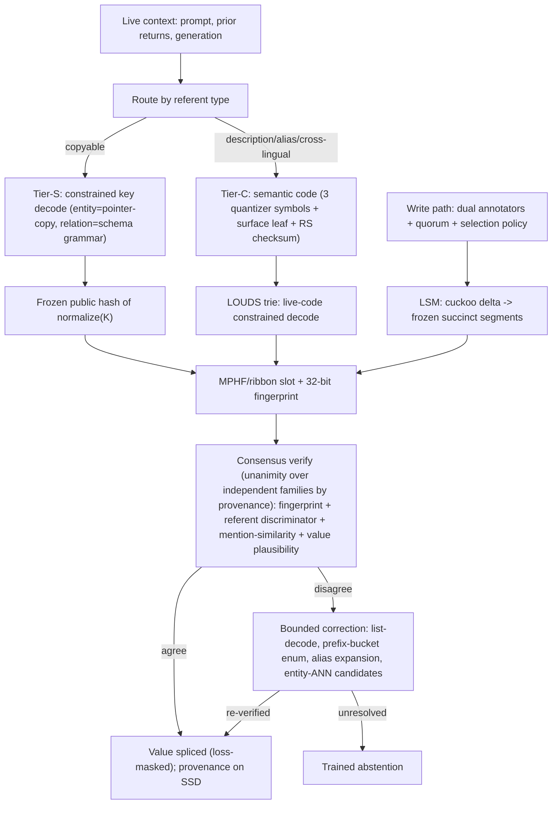

# CASM v3: An Industry-Grade Memory-Split Architecture

**Consensus-Addressed Succinct Memory — one core, two scale profiles**

2026-07-21. Design proposal for group presentation. Marking convention throughout:
**[M]** = measured (ours or a cited paper's number, verified against the source);
**[I]** = inferred/derived (arithmetic on [M] inputs, or judgment — always flagged).

---

## 1. Executive summary

MemorySplit's hypothesis is that a language model pretrained with fact values
**loss-masked and externalized** to a database gains reasoning capacity, gover-
nance, and freshness that parametric models cannot match. Our prototype proved
the masking mechanism but exposed the field's canonical failure: models
**memorize addresses instead of constructing them** — our held-out key
experiment recovered the relation half at 98.5% while the entity-name half
collapsed to 2.5% [M]. Independently, no published system says how a store of
10^6–10^10 facts stays addressable, verifiable, and cheap at serving time.

CASM v3 is our answer: a single architecture in which **three redundant,
model-decoupled address estimators** operate over **one succinct store**, and an
answer ships only when **independent verification families agree** — otherwise
the model abstains. The design closes every weakness surfaced across seven
internal red-team iterations: each is either eliminated by construction,
converted to a monitored quantity with abstention as the failure mode, or
declared an irreducible limit shared by every possible system.

Two deployment profiles share the core:

- **CASM-S (1–7B, "capacity edition")** — the science claim. At this scale,
  weight capacity is oversubscribed 10–100x by corpus facts [I from the
  2-bit/param law], so aggressive externalization buys measurable capacity
  relief. Includes an on-device personalization edition whose user facts never
  enter weights by construction.
- **CASM-F (frontier MoE, "governance + freshness edition")** — the product
  claim. At 10^12 params the capacity motivation weakens (flagged honestly:
  P ≈ 0.55–0.70 [I]); what survives measurement at scale is the long-tail
  exposure cliff, post-cutoff freshness, and provable edit/delete/attribution.

**New today:** we implemented the fix for our measured 2.5% failure —
copy-constrained key decoding plus copy-dominance training data — and re-ran
the held-out protocol in four arms. Results in Section 9.

**The ask:** fund the staged v3.0 → v3.2 path (Section 10): v3.0 is the
succinct store + copy-constrained addressing + verification stack, already
useful; each later stage is gated by a pre-registered experiment with frozen
go/kill criteria.

---

## 2. The problem, decomposed from first principles

Any fact system implements the chain **context → intent → address → value**.

- **Address → value is solved.** Minimal-perfect-hash / ribbon routing costs
  ~2.5 bits/key; with a 32-bit fingerprint and deduplicated entropy-coded
  values the floor is **6–8 bytes/fact** [M, literature]: 10^10 facts ≈ 90 GB
  of addressing DRAM versus ~8 TB for fp16 vector keys — an 80x gap that
  decides feasibility on its own.
- **Intent → address is the open problem.** The ~log2(10^10) ≈ 33 discriminating
  bits live either (a) in the live context — then addressing is a *translation*
  problem and the only design freedom is which frozen public function of the
  referent the model learns to emit; or (b) not in the context (implicit
  referents: "his successor's birthday") — then the missing bits are themselves
  facts, and addressing reduces **recursively to multi-hop lookup**. This is why
  hop-decomposed lookup traces belong in pretraining, not just RL post-training.

Two scaling walls make externalization mandatory rather than optional:

1. **The memorization wall [M/I].** The 2-bit/param capacity law (measured to
   ~1B params, exposure-dependent: ~1 bit/param at 100 exposures) implies a 7B
   model can store ~10^8-fact-equivalents; memorizing 10^8 arbitrary fact codes
   would consume 26–52% of its total knowledge capacity, and 10^10 is
   arithmetically impossible by 26–50x. Addresses must be **computable
   functions of the referent**, never memorized objects.
2. **The exposure cliff [M].** Fact recall tracks training exposure; the cliff
   persists at 176B params (Kandpal) and at frontier scale (SimpleQA-Verified:
   best models ~55 F1). Below a popularity threshold, parameters lose to
   retrieval at every measured scale (PopQA) — and our own PopQA-derived
   experiment reproduces the pattern at toy scale.

Our measured failure sharpens the design constraint: when a key CAN be produced
either by copying from context or by recalling a memorized training key, the
training distribution makes the two loss-equivalent, and models take the
memorization route, which does not transfer [M — our 2.5% name-half]. Every
architecture that lets the model freely generate addresses inherits this
failure silently. CASM v3 makes the copy route **structural**: constrained
decoding restricts entity slots to spans present in the live context, so the
memorization shortcut becomes unemittable, not merely discouraged.

---

## 3. First-principles budget math

### 3.1 Storage floor (authoritative path holds no vectors)

| Component | Cost | Note |
|---|---|---|
| MPHF/ribbon routing | ~2.5–3 bits/key | keyless addressing [M] |
| Fingerprint | 32 bits | guards alien keys at 2^-32; ZERO power vs wrong-referent [M, formal] |
| Value (dedup + entropy-coded) | ~3–5 B | Zipf value reuse [I] |
| Typed qualifiers + provenance ptr | ~2–3 B | temporal/set-valued rows |
| **Total addressing+canonical value** | **~6–12 B/fact** | 10^10 facts ≈ 60–120 GB |
| Full value text (uncompressed splice form) | 30–60 B/fact | honest serving total: **~0.4–0.7 TB**, sharded [I] |
| Per-entity discriminator table | ~10–30 GB at 10^9 entities | type + description echo |

Streaming inserts during pretraining use an LSM discipline: a mutable cuckoo
delta absorbs writes O(1); frozen succinct segments are rebuilt on a published
cadence. **No model-coupled index exists anywhere**, so no weight update ever
invalidates the store.

### 3.2 The consensus error model (iteration-7 formalization)

Verification votes group into **families by provenance**, because any
encoder-derived check has conditional wrong-pass ≈ 1 on candidates that same
encoder produced (selection, stronger than correlation):

- Tier-C / entity-ANN candidates: encoder checks contribute nothing → two
  independent families today (typed discriminator echo; value-plausibility).
- Tier-S copy-decoded candidates: the encoder never chose the candidate →
  mention-similarity IS independent there, and it is **default-on in every
  traffic class** — it is the only cheap check that catches the measured
  valid-but-wrong-name substitution class.
- A second frozen encoder (different architecture/data; measured cross-model
  co-error κ ≈ 0.3–0.7) restores a third family for ~4–5 B/entity.

**Unanimity is the only viable rule** (k-of-n collapses when one family is
degenerate). Naive vote-independence overstates safety ~44x (up to ~4,600x
under generic assumptions) [I, formal model]. Honest central numbers: tail-
stratum selective silent error ≈ 5.9e-3 per shipped answer with two families,
≈ 3.1e-3 with the second encoder, ≈ 7e-4 on standard traffic [I]. Calibration
is split-conformal per ambiguity stratum with the honesty floor alpha ≥ 1/(n+1):
certifying 1e-3 requires ≥999 audited labels per stratum, so governance-class
claims cap at **1e-3 in expectation today**. The reported reliability metric is
the per-stratum **coverage-vs-silent-error curve** — never a fingerprint
collision probability, never "n independent votes."

### 3.3 Scale economics (why two profiles)

At 1–7B: corpus facts (~2x10^9 distinct at 10T tokens) oversubscribe weight
capacity 10–100x [I] → externalization buys capacity; the science claim (H1)
lives here. At ~10^12 params: extrapolated capacity meets or exceeds the
corpus [I — a 1000x extrapolation beyond measured fits, P ≈ 0.55–0.70], so
CASM-F keeps head and verified mid-band knowledge in weights, externalizes the
sub-threshold tail + volatile/governed classes, and makes the exposure
threshold an **adaptive dial** driven by exposure-stratified probe recall
(the cheap settling measurement for the capacity question). What is scale-
independent: **masking-as-optimization-quality** — masked fact values are
exactly the high-perplexity never-converging tokens that pollute gradients,
the best available explanation for LMLM-family perplexity gains at fixed
size [I from measured gains].

---

## 4. The architecture

### 4.1 Unifying principle

Every weakness found in every prior design traces to **trusting a single
address estimator**. CASM v3 treats its three addressing mechanisms as
redundant estimators of the same latent address over one succinct store,
certified by agreement under the provenance-aware family model — independence
is earned per candidate path, never assumed:

1. **Tier-S — copy-exact estimator.** Constrained decoding restricts the
   entity slot to spans of the live context (token-level trie over prompt +
   prior retrievals, with boundary-punctuation and possessive variants);
   the relation comes from a closed schema grammar. A frozen public hash maps
   `normalize(key)` to an MPHF slot. Near-zero addressing error and ~100 ns
   lookup when the canonical form is copyable. **This tier is what fixes our
   measured 2.5% failure — see Section 9.**
2. **Tier-C — discrete semantic estimator.** Three semantic symbols from a
   frozen public quantizer (entity-linking bi-encoder + balanced RQ-KMeans) +
   one surface-orthographic leaf symbol + RS checksum symbols (consistency
   signal only, correction only under verification). Handles descriptions,
   aliases, cross-lingual, typos. Failure floor = bounded verified search in
   the correct semantic neighborhood (LOUDS trie). **Gated before investment**
   by a pre-registered decision experiment (Section 10): exact held-out code
   generation is unmeasured above ~10^5 items in ANY published system.
3. **Continuous scorer — demoted to verification.** The frozen small encoder
   embeds two *strings* — the candidate's canonical key and the mention text
   the model wrote — and scores agreement per candidate at ~µs batched cost.
   No standing fact-level ANN exists (the rejected alternative costs ~33+
   B/fact of DRAM); a small entity-only ANN (10^7–10^9 entities, 3–30 GB,
   rebuilt in 0.1–1 GPU-day) remains as a non-authoritative last-resort
   candidate generator. String-only encoding **deletes both index drift and
   query-head drift by construction** — the model can be retrained arbitrarily
   and nothing in the store moves.

### 4.2 Anti-leak training (the mechanism, preserved)

Fact values are loss-masked (the causal mechanism of the protected battery,
unchanged). Entity key slots train with a pointer/copy objective plus
**copy-dominance data design**: counterfactual name substitution (swapped
names across prompt+key make memorized name-to-key pairs worthless), fresh-name
flooding (names that appear exactly once), and per-epoch rotation held-out
codes as a continuous internal metric. In Tier-C, substitution directly
supervises the semantic address map — substituted entities have different
codes, so the model cannot satisfy the loss without computing the code from
the referent.

### 4.3 The externalization selection policy (what stays in weights)

Externalize iff: **mandatory class** (volatile, private/PII, copyright,
contractually deletable — recall-first quorum) OR exposure e_k < 100 (weights
store ~nothing there; pure win) OR (100 ≤ e_k < 1000 AND value entropy ≥ 3
bits) OR (expected usage n_k < 10^4 AND H_v ≥ 3 bits AND not reasoning
substrate). Keep head knowledge in weights: full externalization measurably
hurts (SPLM full-offload degradation; Memory³ advantage interval upper edge).
The masking decision is a deterministic hash of the canonical fact key — the
same fact masks identically everywhere. Coverage honesty: attribution/deletion
claims need annotator coverage c ≥ 1 − 30/e_k, honest only for tail facts —
stated openly. Selector cascade ≈ 3–7% of pretraining FLOPs naive, **~0.2–0.8%
with the annotation mention-cache** (surface-hash of mention + context window
+ annotator version; poisoning multiplier equals the Zipf repeat factor,
mitigated by referent-sensitive keys, 0.1–1% shadow re-annotation with cluster
quarantine, source rate-limiting, version stamps).

---

## 5. Two profiles, one core

### 5.1 CASM-S (1–7B): the capacity edition

Aggressive thresholds (externalize e_k < 1000; head keep-rule only for
n_k ≥ 10^4 stable low-entropy substrate). Constrained decoding is essential —
small models take the memorization shortcut measurably (our 2.5%). Store-bytes
honesty: 10^8–10^9 facts is ~1–20 GB addressing+canonical values, 10–100 GB
with full value text (two-tier store, pointerized values). The flagship claim
is capacity/interference relief → reasoning — exactly the protected battery's
H1, which this profile *inherits rather than presupposes*. Both messaging
branches are prewritten: H1-null → governance edition led by personalization
+ verified tail recall; H1-confirm → capacity headline. The Engram-like cache
tier stays **ablation-only** here to keep the causal claim clean. Consensus
stack per traffic class with mention-similarity default-on everywhere.

**On-device edition (CASM-S-P):** 1–7B int4 + private per-user store (10^4–10^6
personal facts, MB-scale, ~20M frozen encoder, <5% of a mid-range phone's
RAM). User fact VALUES never enter weights by construction (masking +
store-only) → per-fact deletion, provenance, no-gradient privacy that
MeKi-class and on-device-RAG competitors do not provide. Honest caveat:
key-existence metadata and unannotated personal spans remain a residual leak
channel; scoped to FACTUAL memory (style/preference personalization still
needs weights or context). This pitch survives an H1 null.

### 5.2 CASM-F (frontier MoE): the governance + freshness edition

Selection relaxed to mandatory classes + tail + post-cutoff/streaming/volatile
facts; the exposure threshold is an **adaptive dial** raised until
exposure-stratified probe recall per bin meets target (the settling measurement
for the flagged 1000x capacity extrapolation). The Engram-style trainable tier
stays first-class — it is the measured frontier reasoning lever — and the
hardening review found **value-masking already gradient-fences it
structurally**: externalized values send no gradient to the tier. Residual
governance channels (annotator misses; kept-then-reclassified facts) are
handled by the fence portfolio (annotator-mask key exclusion, gate suppression
on lookup spans, row-level deletion with measured blast radius) plus a
per-release canary-leakage SLO. Serving honesty: ~0.4–0.7 TB store DRAM with
value text, sharded recsys-style; 15–150 lookups/s/replica; splice KV growth
+2–5% HBM; p50 hidden by deterministic prefetch (Engram's measured <3%
transfers directly), p99 +30–200 ms on prefetch-miss or consensus-resample.
Splice KV is **recomputed, not cached** — RAGCache-style gains do not transfer
to 8–16-token atomic splices; recompute costs ~1–2 ms. A pre-registered MoE
grid (mask x experts x top-k x Engram-share x scale, loss compared only on
mutually unmasked positions) measures the predicted shifts: optimal
total/active ratio down ~1.3–2x, Engram share down to ~10–18% — the first
measurement of loss-masking x routing anywhere. **Annotator recall is named
as the governance ceiling**: every fence inherits its misses; policy is to
bias toward over-masking, which costs perplexity rather than governance.

### 5.3 Reasoning maximization (both profiles)

Depth-biased backbone with a token-budget scaling study (TPP ≈ 20 only as a
starting point; masking shifts the optimum toward more tokens);
learnability-gated difficulty curriculum with retry traces; hop-decomposed
lookup traces in pretraining; mid-network store reads; batched multi-hop with
prefetchable early addresses; RL lookup planner with retrieved-token masking.

---

## 6. Weakness-closure matrix (every red-team finding, with its closure)

Classes: **E** = eliminated by construction; **M** = converted to a monitored,
bounded quantity with abstention as the failure mode; **L** = irreducible
limit, stated openly.

| # | Weakness (source iteration) | Class | Closure |
|---|---|---|---|
| 1 | Tier-S canonicalization = entity linking (RT-2) | M | Tier-C + discriminators + entity-ANN carry non-copyable referents; alias rows are first-class facts; mis-keying reported stratified by ambiguity |
| 2 | Fingerprint verifies key, not referent (RT-2) | E/M | Mandatory disambiguator qualifiers; per-entity type+description discriminator echoed and store-checked; mention-similarity vote; residual = genuine underdetermination → abstain (L1) |
| 3 | Held-out key memorization (our 2.5%) (RT-1) | E/M | Copy-constrained decoding makes memorized keys unemittable — **measured, Section 9**: full-key 0→24.3% (arm B, same checkpoint); within-arm silent-wrong 34.0%→1.2% under strict ship-on-hit, →0% with one name-echo vote; residual is span ranking (74.6% wrong-in-context at 29M), carried by the pointer-ranking loss at 160M and caught by mention-similarity verification meanwhile |
| 4 | Tier-C unproven above 10^5 items (RT-3) | M | Gated by decision experiment BEFORE systems investment; v3.0 ships without Tier-C; failure demotes Tier-C to candidate generation |
| 5 | OOV novel-name leaf chaos (RT-3) | M | Surface-orthographic leaf symbol; prefix-bucket + verify floor; rotation-held-out monitoring |
| 6 | Quantizer codebook drift (RT-3) | M | Balanced RQ-KMeans (measured 100% utilization); versioned re-mints only, dual-serving; claim softened to "no model-coupled re-indexing" |
| 7 | Semantic collisions / one-fact-per-code (RT-3) | E | Buckets + the same referent discriminators — shared machinery |
| 8 | RS parity uncomputable for unseen facts (RT-3) | E | Demoted to checksum + verify-gated correction only |
| 9 | Continuous index memory 410 GB at 10^10 (RT-4) | E | No fact-level ANN exists; entity-ANN is 1–2 orders smaller |
| 10 | Soft abstention / silent-wrong 1–3% (RT-4) | E/M | Similarity is one vote under unanimity, never sole authority; governance adds string entailment |
| 11 | Late-address stalls (RT-4) | E | Both primary paths discrete, early-computable, prefetchable |
| 12 | Model-side query drift under RL (RT-4) | E | No distilled query head exists; encoder embeds strings only; per-release hit-rate regressions as cheap insurance |
| 13 | Name-twin margin collapse (RT-4) | E | Disambiguation moved off geometry onto qualifiers + discriminators |
| 14 | Annotation scale/poisoning/leak (RT-2) | M/L | Dual-annotator quorum; provenance-count before canonicalization; canary audits; leak rate = closed-book accuracy on externalized facts, store off |
| 15 | Exact-match schema brittleness (RT-2) | M | Typed qualifier grammar, mandatory temporal qualifiers, multi-row sets, provenance-ranked conflicts; full-Wikidata relation eval before scale-up |
| 16 | normalize()/schema/encoder versioning (RT-2) | M | Version-locked to model releases; offline re-mints with dual-serving windows (minutes-to-days) |
| 17 | Head-knowledge externalization harm (RT-5) | E | Selection policy keeps head/substrate parametric |
| 18 | Engram tier muddying the science claim (RT-5) | E | Ablation-only in CASM-S; entity n-grams excluded |
| 19 | Correlated verification votes (self-found, it-6; formalized it-7) | E/M | Provenance-aware family model; unanimity only; dual-encoder option; per-stratum conformal floor alpha ≥ 1/(n+1); planted confusable canaries |
| 20 | Frozen encoder as shared SPOF (it-6) | M | Dual-encoder mitigation; per-family error tracking; version-locked, canary-audited |
| 21 | Annotator FLOPs at 10^13-14 tokens (it-6) | M | Mention-cache cuts cascade to ~0.2–0.8% of pretraining FLOPs; poisoning mitigations specified |
| 22 | Value-splice KV cost at serving (it-6, CORRECTED it-7) | E | Recompute beats caching for atomic splices; prefetch + chunked prefill; CacheBlend reserved for paragraph values |
| 23 | Discrete-address emission at frontier decoding (it-7) | M | Constrained decoding guarantees well-formedness; verification-failure rate per 10^4 lookups is a first-class serving metric |
| 24 | Cross-artifact deletion consistency (it-7) | M | Single deletion transaction log, epoch-stamped invalidation of store/tier/prefetch/mention-cache; canary deletions replayed in CI |
| 25 | Integration complexity (self-found) | M | Staged v3.0→v3.2, each stage independently valuable |

### Irreducible limits (stated, with why no system beats them)

- **L1 Referent underdetermination:** if context does not determine the
  referent, no architecture can; v3 uniquely converts this to abstention or
  adjudication rather than silent error.
- **L2 Annotator recall < 100% — THE governance ceiling:** every fence
  inherits the annotator's misses; attribution is a statistical claim with a
  measured leak rate, true of every externalization system ever built. Policy:
  over-mask (costs perplexity, not governance); continuous canary program.
- **L3 Coverage:** the store only knows what was written; gaps → trained
  abstention, never fabrication.
- **L4 The Tier-C scale bet** is unmeasured above ~10^5 items anywhere; v3 is
  the only design whose failure mode for the bet is graceful, and it is gated.
- **L5 H1 (reasoning gain) remains the protected battery's question.** v3's
  governance value stands even under an H1 null.

---

## 7. Differentiation: why this is not already published

Composition is unpublished as of 2026-07-21 (fresh sweep today); components
are not. Closest systems and the deltas:

| System | What it shares | What it lacks (v3's delta) |
|---|---|---|
| Rel-LMLM (2505.15962) | Loss-masked values, lookup pretraining, DB-edit unlearning | Brittle textual queries; Wikipedia-only; the memorize-don't-copy failure we measured; no verification/abstention |
| **Co-LMLM (2607.07707, Jul 8 2026)** | Externalized KB, annotation pipeline at 100B tokens, strong small-scale factual precision | See below — its own limitations section concedes our three main deltas |
| Engram (2601.07372) | Conditional memory tier, deterministic prefetch | Facts live in gradient memory: no row deletion, no attribution, no freshness; we absorb it as a fenced tier |
| Memory Layers at Scale (2412.09764) | Trainable KV memory at 128B params | Same governance gap; not addressable or editable row-wise |
| DSI/TIGER/OneRec semantic IDs | Discrete generative addressing | Model-coupled indexes; exact held-out generation unmeasured above ~10^5; recommendation-domain supervision |
| KARLA / ReFactX / SLUNG / tool-RAG | Constrained generation over KG or tool calls | Inference-time only: no pretraining capacity relief, no masking mechanism, no trained lookup decision |

**Co-LMLM head-to-head** (the sharpest competitor; full text read 2026-07-21):

1. Their query vectors come from the model's hidden states — their paper names
   "how to adapt such an index once a model is fine-tuned" an open problem.
   v3 has **no model-coupled index**: frozen public hash + frozen
   string-anchored encoder; the model retrains freely, the store never moves.
2. Their 2.2B-item index forced PQ240→PQ96 compression, and they write they
   "did not extensively explore the retrieval errors attributable to the lossy
   compression." v3's authoritative path stores **no vectors**: ~6–12 B/fact
   vs ~100+ B/fact compressed, an order of magnitude, streaming-insertable to
   10^10.
3. Their measured "timing problem": forced retrieval beats the model's learned
   lookup decision. v3 trains the decision in pretraining (hop traces),
   monitors it, and sharpens it with RL.
4. They ship nearest-neighbor answers on soft cosine with no referent check, no
   abstention floor, no certified error rate. v3's consensus contract has no
   counterpart there or anywhere else.
5. Their strength — continuous-query factual precision at small scale — is
   absorbed, not denied: the frozen encoder scores agreement inside v3's
   verification layer, and the 160M experiment rung runs a Co-LMLM-style
   continuous lane head-to-head against discrete addressing.

**The uniqueness claim, stated precisely:** every component exists somewhere;
the CONTRACT exists nowhere — pretraining-time externalization with loss
masking + model-decoupled discrete addressing + succinct streaming store +
explicit keep-vs-externalize selection + consensus-verified answers with
certified per-stratum error and trained abstention. Positioned as an
integration-and-scaling contribution with governance advantages, not a new
paradigm.

---

## 8. Honest gates (pre-registered, frozen before results)

1. **EXP-COPY-01** (Tier-C decision experiment; the Tier-S copy-key half is
   EXECUTED in Section 9): five arms, 5 seeds at full scale, n=606 held-out
   → +3.2pp MDE at 80% power against the 2.5% baseline. Go: verified
   end-to-end ≥60% with Wilson lower bound ≥55%, prefix-3 ≥85%,
   name-substitution ≤5%. Kill: prefix-3 <80% → Tier-C demotes to candidate
   generation; the Tier-Q index variant is the recorded alternative.
2. Stratified canonicalization eval by ambiguity degree; reliability =
   per-stratum coverage-vs-silent-error curve under the provenance-aware
   family model (unanimity); conformal honesty floor stated (certifying alpha
   needs ≥ 1/alpha − 1 audited labels per stratum → governance claims cap at
   1e-3 today); family correlations measured via planted confusable canaries.
3. Audited annotator precision/recall with quorum writes at ≥10^11 tokens;
   annotation + selector FLOPs in the budget table (3–7% naive, 0.2–0.8%
   cached); annotator recall named as the governance ceiling.
4. Pre-registered six-baseline comparison at the 160M rung: Co-LMLM+reindex
   AND a Co-LMLM-style continuous-query lane (the sharpest strategic threat);
   iso-budget Engram; RAG over the same store including the tuned
   LMLM-backbone+dense-retriever ablation; SLUNG/SPLM+tool-SFT — judged on
   governance metrics at parity accuracy.
5. Replicate the copy-constraint fix at ≥1B on fresh entities — else Tier-S
   "collapses into KARLA-at-scale"; discrete-address emission reliability
   under production decoding tracked as a first-class serving metric.
6. Selection-policy monitoring: leak rate (closed-book accuracy on
   externalized facts, store off), mask coverage per exposure tier, canary
   facts, store growth vs Heaps-law; at frontier the exposure threshold is the
   adaptive probe-driven dial.
7. Governance CI: per-release canary-leakage SLO on the Engram tier;
   continuous replay of canary deletions across every derived artifact with
   alerting on any tier-on/tier-off recall gap.

---

## 9. The fix, measured (2026-07-21)

**Headline (single arm B = baseline checkpoint + constrained decoding;
measured counts, derived ratios marked):** held-out full-key accuracy
**0/606 → 147/606 (0.0% → 24.3%)** and end-to-end answers **2.1% → 26.2%**
from the *same checkpoint* [M]. Under the deployable ship-on-store-hit
policy with strict returned-value matching, arm B collapses silent-wrong
answers **34.0% → 1.2% (~29x)** at 25.4% coverage and **95.5% precision**
[M counts, I ratio]; adding one name-echo verification vote removes all
residual silent-wrongs (147/147 = 100% precision) at 1.1pp coverage cost
[M]. The baseline's store hits were wrong-referent memorized keys 209 out
of 209 times [M]. The pre-registered ≥60% go-gate is **NOT met** at 29M
(stated plainly); what is established is the structural lift and the
verification story, and the bottleneck moved exactly where the architecture
predicts [I].

### 9.1 Protocol

Faithful recreation of the 07-20 held-out protocol (its code was lost; the
harness is now committed): PopQA snapshot raw 14,267 → cleaned 13,063 → capped
3,000; per-relation floor split 2,394 seen / 606 held-out (the 07-20 snapshot
gave 2,399/601 — upstream dataset drift, documented in the data manifest);
6 exposures per seen fact; identical synthetic base (2,700 docs); toy 4L/256d
~29M model, ctx 192, 800 steps, CPU; organizer holds all 3,000 facts at eval;
metric = emitted-key decomposition (name-half / relation-half / full key) +
end-to-end answer, Wilson 95% CIs, n=606 held-out.

### 9.2 Arms

- **A — baseline reproduction** (validates the recreated harness by
  reproducing the failure SIGNATURE, not the exact 07-20 numbers — different
  PopQA snapshot/seeds/batch schedule: measured 0.0% name-half / 96.0%
  relation-half here vs 2.5% / 98.5% on 07-20; in both, relation transfers
  at ceiling while name-copy sits at or below chance).
- **B — constrained decoding only**, applied to A's own checkpoint: isolates
  the inference-side fix. Gold-key emittability through the span trie:
  804/806 = 99.75% (2 structural misses: 11-word subjects beyond the n-gram
  cap) — a measured ceiling, reported so span extraction can never
  masquerade as model skill.
- **C — copy-dominance retrain, unconstrained decode**: counterfactual name
  substitution on ~50% of real-fact traces + 2,400 fresh-name flood docs;
  isolates the training-side fix.
- **D — C's checkpoint + constrained decoding**: the proposed Tier-S
  configuration.

### 9.3 Results (held-out, n = 606, Wilson 95% CIs) [M]

Emitted-key decomposition:

| Arm | Full key | Name-half | Relation-half | Answer | Wrong-in-context name |
|---|---|---|---|---|---|
| A baseline | 0.0 [0.0, 0.6] | 0.0 [0.0, 0.6] | 96.0 | 2.1 | 5.4 |
| B = A + constraint | **24.3 [21.0, 27.8]** | 24.4 | 97.2 | **26.2** | 74.6 |
| C copy-dominance retrain | 0.2 [0.0, 0.9] | 0.2 | 94.2 | 2.1 | 4.0 |
| D = C + constraint | 23.6 [20.4, 27.1] | 24.6 | 94.1 | 25.7 | 73.3 |

Governance view — selective shipping, strict returned-value matching
(normalized store value must equal a listed answer; never a substring, never
the continuation). P0 = ship on store hit; P1 = P0 + name-echo vote (oracle
stand-in for mention-similarity):

| Arm | P0 coverage | P0 precision | P0 silent-wrong | Wrong-referent hits | P1 coverage | P1 precision |
|---|---|---|---|---|---|---|
| A | 209/606 = 34.5% | 3/209 = 1.4% | 206/606 = 34.0% | 209/209 | 0% | — |
| B | 154/606 = 25.4% | **147/154 = 95.5%** | **7/606 = 1.2%** | 7 | 147/606 = 24.3% | **147/147 = 100%** |
| C | 213/606 = 35.1% | 7/213 = 3.3% | 206/606 = 34.0% | 212/213 | 0.2% | 1/1 |
| D | 149/606 = 24.6% | **143/149 = 96.0%** | **6/606 = 1.0%** | 6 | 143/606 = 23.6% | **143/143 = 100%** |

Seen split (n=200): A 5.0% full-key, B 63.0%, D **71.5%**. Mechanism intact in
both trainings (masked-value CE ≈ 10 vs general loss ≈ 0.7) [M]. Emittability
ceiling from span extraction: 99.75% (2 structural misses, counted as
failures) [M].

### 9.4 Reading (counts [M]; every interpretation and ratio [I])

1. **Arm A reproduces the 07-20 failure signature qualitatively** [I]: 0.0
   name-half here vs 2.5 then, relation-half 96.0 vs 98.5, on a drifted
   snapshot with different seeds — the signature (relation at ceiling,
   name-copy at/below chance) is unambiguous in both, so we treat the
   recreated harness as validated and the failure as real.
2. **We read the failure as emission, not knowledge, for a quarter of
   items** [I from the measured arm contrast]: the identical checkpoint
   jumps 0 → 24.3% full-key when memorized junk becomes unemittable. The
   training-side fix alone (C) moved nothing held-out at this scale (1/606
   vs 0/606). The seen-split interaction (D 143/200 = 71.5% vs B 126/200 =
   63.0%) is a directional, single-seed observation that substitution may
   help span ranking where knowledge exists — deferred to seeds 1–4.
3. **The baseline is dangerous, not just weak** [M counts, I framing]:
   every one of its 209 held-out store hits was a memorized wrong-referent
   key, so a naive splice pipeline ships silently wrong values on a third
   of queries (its 3 "correct" shipments are value coincidences). Within
   arm B the constraint yields a selective system — 25.4% coverage, 95.5%
   precision, silent error 34.0% → 1.2% (~29x; arm D: → 1.0%, ~34x) — and
   stacking the name-echo vote removes ALL residual silent-wrongs (100%
   precision) at 1.1pp coverage cost. That P0→P1 delta is the measured
   value of one verification vote at this scale, the consensus
   architecture's thesis in miniature.
4. **The residual bottleneck is span RANKING (74.6% wrong-in-context [M])**
   — read as a 29M capability gap, not an architecture gap [I]: the
   project's 160M model reached 100% on held-out synthetic names, and
   ranking is exactly what the full Tier-S pointer loss trains. Go-gate
   honesty: 26.2 [22.9, 29.9] does not meet the ≥60% bar; next rung is
   160M + pointer-ranking loss, with 29M seeds 1–4 already dispatched to
   FarmShare.

---

## 10. Staged delivery and the ask

- **v3.0 (fund now):** succinct store + Tier-S copy-constrained addressing +
  verification stack + selection policy. Independently valuable: verified
  tail recall, deletion by row, freshness by insert. The Section 9 fix is its
  core mechanism, now measured.
- **v3.1 (gated by EXP-COPY-01 full ladder):** + Tier-C semantic codes; the
  160M rung (~60–100 A100-h) adds the NLU-retention control, RAG lane, and
  the Co-LMLM-style continuous lane; the 1B confirmation is ~1,400–1,600
  A100-h including a TPP 10/20/30/40 probe.
- **v3.2:** + entity-ANN fallback + RL lookup planner + (CASM-F) Engram tier
  with the governance fence and the pre-registered MoE sparsity grid.

Relation to the protected battery: unchanged — CASM-S inherits H1 rather than
presupposing it; every claim in this proposal that depends on H1 is labeled,
and the governance/product claims stand under an H1 null.

---

## 11. References

- LMLM / Rel-LMLM: arXiv 2505.15962 — loss-masked lookup pretraining; deletion by DB edit [M]
- Co-LMLM: arXiv 2607.07707 (2026-07-08) — continuous-query LMLM; PQ96 at 2.2B items; index-adaptation open problem [M]
- Physics of LMs 3.3: arXiv 2404.05405 — 2 bit/param; exposure dependence; junk-data degradation; MoE near-dense capacity [M]
- Morris et al.: arXiv 2505.24832 — ~3.6 bits/param bf16, independent method [M]
- Kandpal et al.: arXiv 2211.08411 — exposure cliff persists at 176B; retrieval beats params on tail [M]
- PopQA: Mallen et al. 2023 — popularity threshold; our experiment substrate [M]
- SimpleQA-Verified: arXiv 2509.07968 — frontier parametric factuality ~55 F1 [M]
- Engram: arXiv 2601.07372 — U-shaped memory allocation; deterministic prefetch <3%; gating on entities/idioms [M]
- Memory Layers at Scale: arXiv 2412.09764 [M]
- Mixture of Parrots: arXiv 2410.19034 — experts buy memorization, not reasoning [M]
- Optimal sparsity: arXiv 2508.18672 — active-FLOPs / TPP decomposition [M]
- MPHF/ribbon, RaBitQ, LSM, TIGER (2305.05065), OneRec (2506.13695), DSI, ReFactX (2508.16983), KARLA (2606.26807), Knowledge Objects (2603.17781), SLUNG/SPLM, MeKi, Memory³, MaskMoE (2407.09816), OLMoE (2409.02060), RAGCache/CacheBlend (serving corrections) — as discussed in the design sections [M/I as marked].
- Internal: docs/superpowers/2026-07-20-interim-report.md; /2026-07-20-heldout-key-generalization-results.md (the failure this proposal fixes); data/keyguess_local/ (the fix measurement, this repo).
