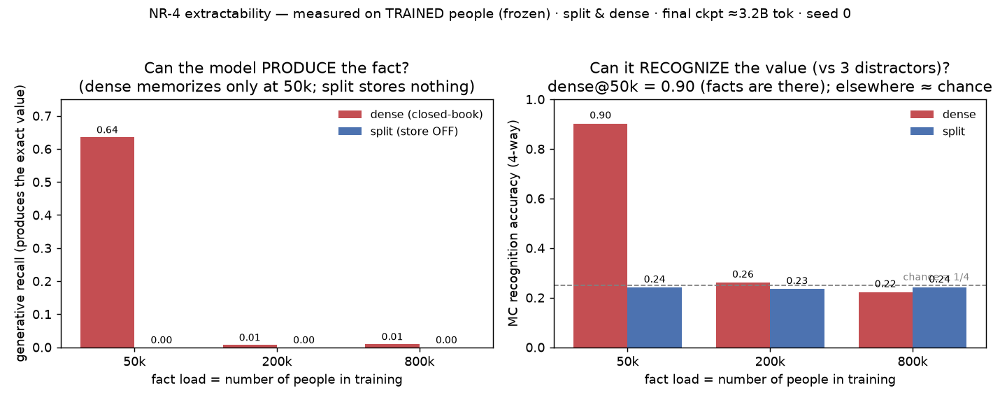

# NR-4 — Extractability: is a fact *not stored* or *stored-but-hard-to-produce*?

> **Entity population: SEEN (frozen trained people) — required.** "Is the fact stored?" is only
> defined for people the model trained on, so this is run on the frozen trained people via
> `evals/frozen.py`. See [`../ENTITY-POPULATIONS.md`](../ENTITY-POPULATIONS.md).

## Summary box — read this first
*New here? [START-HERE](../START-HERE.md) explains the dense-vs-split experiment; the one line
you need: the **dense** twin memorizes facts in its weights; the **split** twin looks them up.*

**What this probe asks, in plain terms.** When a model *can't say* a fact, there are two very
different reasons: **(a)** it never stored the fact, or **(b)** it stored it but can't produce
it in this phrasing. Those mean opposite things about how much a model knows, so this probe
separates them with two read-outs of the same checkpoint:
1. **Generative recall** — ask the model to *produce* the value ("`{name}'s {relation} is` →?");
   did it say the right thing? (dense = closed-book; split = store OFF / weights only.)
2. **Multiple-choice recognition** — show the true value alongside 3 plausible decoys and see
   if the model rates the true one highest (chance = 1 in 4 = 25%).

**How to read it.** Recall high ⇒ **extractable**. Recall ≈0 **but** recognition ≫ chance ⇒
*stored-but-hard-to-produce*. Recall ≈0 **and** recognition ≈ chance ⇒ *genuinely not stored*.

**Why it matters — significance & nuance.** It's the honesty check on every "the model can't
recall X" claim — it guards against **under-counting** what a model knows, which is central to
the H3 question of where facts live. It also gives us a built-in **positive control**: on a
model that demonstrably memorized (dense n50k), recognition *should* be high — and it is (90%),
which validates the recognition probe and lets us trust its "≈chance" readings elsewhere as
real absence rather than a broken probe.

**Which models / checkpoint / people.** Both arms at all three loads (50k/200k/800k), final
checkpoint `snapshots/step0006100.pt`, trained people; generative recall over the recall probe
set, MC over 800 items/run. One seed.

## The finding in one line
When these models can't say a fact, it's because they **genuinely don't have it** — not because
they know it but can't verbalize it. Dense at low load truly memorized (and can both say *and*
recognize its facts); dense at high load and the split model (weights-only) have **nothing
stored** to recall *or* recognize. So "can't recall" here means "isn't there," which means we're
**not under-counting** hidden knowledge — recall is a trustworthy storage measure in this study.

## Result (trained people)
| load | arm | generative recall | MC recognition (chance 0.25) | verdict |
|---|---|---|---|---|
| n50k  | **dense** | **0.64** | **0.90** | **extractable** (stored *and* producible) |
| n50k  | split | 0.00 | 0.24 | consistent with absence |
| n200k | dense | 0.01 | 0.26 | consistent with absence |
| n200k | split | 0.00 | 0.24 | consistent with absence |
| n800k | dense | 0.01 | 0.22 | consistent with absence |
| n800k | split | 0.00 | 0.24 | consistent with absence |

dense n50k per-attribute recognition: birth_date 1.00, birth_city 0.93, current_city 0.89,
employer 0.89, major 0.88, university 0.84 — all far above chance.

## What we found, explained (with the intuition)
**The mental model:** think of a human who can't answer a trivia question. Two cases: (1)
*tip-of-the-tongue* — they actually know it and could pick it from a list even if they can't
blurt it out; (2) *never learned it* — they can't say it *and* can't pick it from a list. The
two tests here are exactly that: **generative recall** = "say it," **multiple-choice
recognition** = "pick it from a lineup of 4." Recognition is the easier test, so it catches
tip-of-the-tongue knowledge that "say it" would miss.

- **Dense at 50k people — it genuinely memorized (knows *and* can say).** It produces the right
  value 64% of the time (matching the battery's 62.4%) *and* recognizes it 90% of the time.
  Both high ⇒ the fact is really in the weights and readily accessible. There's **no
  tip-of-the-tongue gap** — recognition (0.90) is only modestly above generation (0.64), the
  normal "recognizing is a bit easier than producing" margin, not a sign of hidden-but-stuck
  knowledge.
- **Dense at 200k / 800k people — it genuinely never stored the facts (not tip-of-the-tongue).**
  It can't say them (≈1%) *and* can't recognize them (≈chance, 0.22–0.26). The second half is
  the important, non-obvious part: recognition is the sensitive test, and it *worked* at 50k
  (0.90), so its coming up empty here means the knowledge is truly **absent**, not merely hard
  to verbalize. This is the "memorization wall" (too few exposures per person at high load) seen
  from a second angle — and it rules out the alternative "it memorized but can't express it."
- **Split model at every load — the facts simply aren't in its weights.** With its lookup table
  unplugged it produces exactly 0 and recognizes at chance, at all loads. That's not a failure —
  it's the whole design (H3): the split model was never trained to hold values in its weights,
  so there's nothing to say *or* recognize; the knowledge lives in the external table.
- **Why you can trust the "nothing there" readings — the test has a working positive control.**
  The recognition test scoring 0.90 on dense-50k (a model we *know* memorized) proves the test
  can detect a stored fact when one exists. So when the same test reads ≈chance everywhere else,
  that's real absence, not a broken instrument. (This built-in control is exactly what the
  earlier, invalid run lacked.)

**Bottom line / why it matters:** across the board, "can't recall" lines up with "genuinely
absent" — there is **no pool of hidden, un-producible knowledge** we were missing. That means
(a) recall is a fair yardstick for how much each model actually stored, and (b) the split
model's 0/chance is honest evidence it keeps facts *outside* its weights (H3), not evidence of
facts it secretly holds but can't voice.

## Caveats
- **One seed** ⇒ directional. Distractors are pool-matched, so MC chance is a clean 1/4.
- **Behavioral read-outs** of the weights (recall + recognition), not causal tests — but that's
  the right level for "is the fact stored/producible."
- **Split MC is at chance by construction**, not a limitation: the values were never in the
  split weights, so there is nothing to recognize.
- **n50k is the only regime with stored facts**; the n200k/n800k rows are the (informative)
  floor. Numbers are on trained people; the stranger control (in `*_unseen.json`) sits at the
  floor for both arms, as expected — a person you never saw has nothing to recall/recognize.

## Provenance
`scripts/run_extractability.py --records-jsonl …` on the frozen trained people
(`outputs/_frozen_data/<load>_recall.jsonl`). Raw per-run JSON in this folder as
`{load}_{arm}_seen.json` (trained people, authoritative) and `{load}_{arm}_unseen.json`
(strangers, control); figure via `plot_extractability.py`. No training run was changed.
