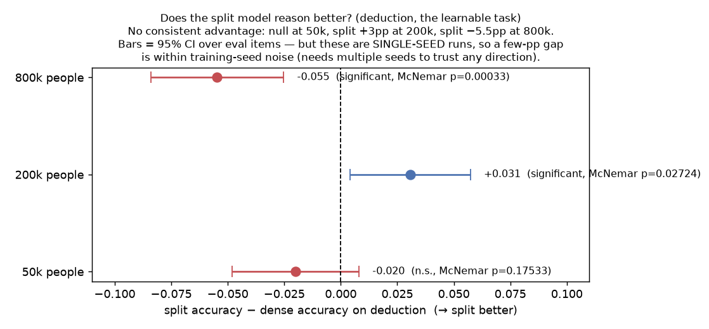

# Does the split model reason better? — the H1 test on deduction

## Summary box — read this first
*New here? [START-HERE](../START-HERE.md) explains the dense-vs-split experiment; the one line
you need: the whole point (H1) is "does off-loading facts free capacity so the split twin
**reasons** better than the dense twin?"*

**What this asks, in plain terms.** This is the **actual payoff test (H1)**. Of the two
reasoning tasks, **iGSM (mod-23 arithmetic) is task-blocked** (≈12%, barely above its 4.3%
floor — it can't test anything). **Deduction is genuinely learnable** (≈65%, well above its 50%
yes/no floor), so it's the one place we can fairly ask: **does split out-reason dense, and does
the gap grow with fact load** (H1 predicts the split advantage should be *largest* where dense
is most memory-burdened, i.e. n800k)?

**How we measure it.** Both arms were evaluated on the **same 1,500 deduction problems** per
load, so we can run a **paired** comparison: McNemar's exact test on the disagreements, plus a
bootstrap 95% CI on the accuracy difference, per fact load and per problem depth.

**Why it matters — significance & nuance.** H1 is the thesis of the whole project. *Nuance,
and it's the decisive one:* these p-values and CIs measure **eval-item sampling noise**, but the
variance that actually matters for "does splitting help reasoning" is **across training seeds**,
and we have **one seed per arm**. Two independently trained 160M models routinely differ by a
few points on a task from seed alone — so a few-pp gap here, even a "significant" one by
item-resampling, is **not** trustworthy evidence of a real effect. Read this as "no consistent,
seed-robust H1 signal," not "we proved split is worse."

## Result (paired, 1,500 problems/load)
| load | dense acc | split acc | split − dense | 95% CI (items) | McNemar p | verdict |
|---|---|---|---|---|---|---|
| n50k  | 0.650 | 0.630 | **−0.020** | [−0.048, +0.008] | 0.175 | no difference |
| n200k | 0.667 | 0.698 | **+0.031** | [+0.004, +0.057] | 0.027 | split *higher* (item-sig) |
| n800k | 0.682 | 0.627 | **−0.055** | [−0.084, −0.025] | 0.0003 | dense *higher* (item-sig) |

Depth 1 vs depth 2 show the same pattern within each load (no depth-specific story). iGSM is
omitted — at ≈12% it's too close to its 4.3% floor to compare arms meaningfully.

## Interpretation
- **There is no consistent split-vs-dense reasoning advantage, and no H1-shaped trend.** The
  gap is tiny and **flips sign across loads**: essentially zero at n50k, split slightly *ahead*
  at n200k (+3.1pp), and dense *ahead* at n800k (−5.5pp). H1 predicts split should pull *ahead*
  as fact load grows (dense increasingly memory-burdened); instead the biggest, most
  "significant" effect is at n800k in the **opposite** direction. So the data give **no support
  for H1** on the one reasoning task that can test it.
- **But don't over-read the "significant" cells — they're single-seed.** The item-level tests
  say the n200k (+3pp) and n800k (−5.5pp) gaps are unlikely to be *eval-sampling* flukes. They
  do **not** rule out *training-seed* flukes, which is the relevant noise here: with one dense
  and one split run per load, a ±3–5pp wobble is exactly what you'd expect from seed variation
  alone. The sign-flip across loads is itself a hint that we're looking at run-to-run noise, not
  a mechanism. **The honest verdict is a null: no trustworthy evidence either way, tilting
  against a positive H1 effect.**
- **This corroborates Stephen's 0.8B/20% null** from a different angle: at 160M too, on a
  learnable reasoning task, splitting doesn't buy a reasoning gain.

## What would make this conclusive
- **Multiple seeds per arm** (≥3–5): re-estimate the split−dense gap with the variance measured
  *across runs*, not across eval items. This is the single most important fix — it converts
  "±5pp could be noise" into a real effect-size ± CI.
- **More reasoning headroom:** depth-1–2 deduction at ≈65% may be too shallow/near-ceiling to
  reveal a capacity difference; deeper problems (or a learnable non-mod arithmetic to replace
  iGSM) would give the effect room to show up.
- **Isolate reasoning from memory:** give the dense arm open-book facts so any residual gap is
  capacity, not fact-access.

## Caveats
- **Single seed per arm** — the dominant caveat (above); item-level significance ≠ effect
  significance.
- **Deduction only** (iGSM is task-blocked); shallow depths (1–2).
- Battery greedy-decode eval; "correct" = parsed yes/no matches gold.

## Provenance
`scripts/run_deduction_h1_test.py` on the battery's per-item results
(`d160m_{arm}_{load}_s0/evals/deduction.jsonl`, pulled to
`outputs/_frozen_data/ded_results/`). Paired McNemar + bootstrap CI. Figure via `plot_h1.py`;
raw in `deduction_h1.json`. No training run was changed.
