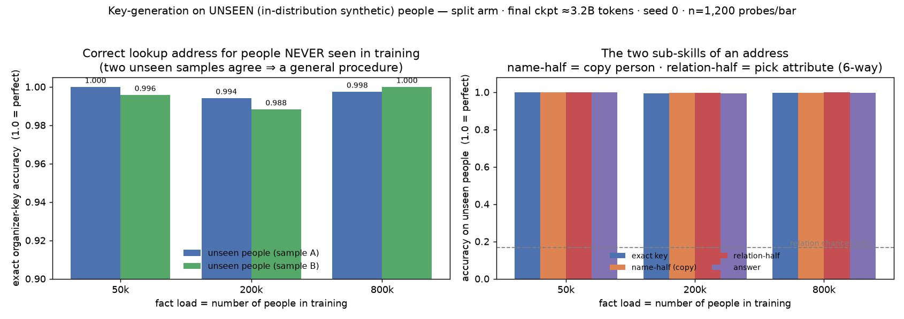

# Key-generation generalization — does the split model address unseen entities?

> **Entity population: UNSEEN — which is exactly the population this probe wants.** Key
> generation is a *copy from the prompt*, so success on **people the model never saw** is
> the generalization result (a memorize-the-keys model would fail on strangers). Both
> groups scored below are unseen samples, so do **not** read the two columns as
> trained-vs-untrained. See [`../ENTITY-POPULATIONS.md`](../ENTITY-POPULATIONS.md).

## Summary box — read this first
*New here? [START-HERE](../START-HERE.md) explains the dense-vs-split experiment; the one
line you need: the **split** twin doesn't store fact values — it writes a little
"look-it-up" query and an external table returns the value.*

**What this probe asks, in plain terms.** To use a fact, the split twin must **write the
correct lookup address** — essentially "`{person}, {attribute}`" — which the table then
resolves into a value. This probe asks the key generalization question: **can it write the
*exactly correct* address for people it never saw during training?** If it merely memorized
addresses for its training people, it would fail on newcomers; if it learned a general
*procedure*, it would succeed on anyone.

**How we measure it.** We prompt the split twin, capture the address it emits, and check it
against the correct one. We separate two independent sub-skills:
- **name-half** — did it **copy the right person** out of the prompt? (a copy skill)
- **relation-half** — did it pick the **right attribute**? (a 6-way choice; chance ≈ 17%)
Every attempt is also bucketed into a clean taxonomy: exactly right (`correct_key`),
right-person/wrong-attribute, both-wrong, never-tried-a-lookup, or malformed.

**Why it matters — significance & nuance.** This is arguably the **most important positive
result about *how* the split design works**. The whole approach only pays off if the model
can reliably **address an external memory for new entities**, not just ones it studied — so
near-perfect address accuracy on **unseen** people is direct evidence that the split twin
learned a **general, reusable addressing procedure** (copy the person + choose the
attribute), which is exactly what an external-memory system needs in order to scale. It is
the *constructive* complement to the other probes: they show the split twin **doesn't** keep
facts in its weights (H3); this shows what it **does** instead — and that it **generalizes**.
*Nuance:* "unseen" here means **new synthetic people in the same format**, not real-world
names/relations (that's the deferred PopQA stress test); and the name-half is a **copy from
the prompt**, an easier skill than recall, so a high name-half means "it copies novel names
correctly," not "it knows these people."

**Which model / checkpoint / people.** The **split** twin only (the dense twin has no lookup
machinery, so it can't play), at all three loads (50k/200k/800k), finished checkpoint
`snapshots/step0006100.pt`, **1,200 attempts per load**. **One seed ⇒ a direction.** Because
of the generator drift (see the banner above), both groups we compared were effectively
**unseen** — which is fine, since unseen is exactly the population this probe cares about.

> **Why this version (and not the literal PopQA test).** The collaborator's
> recipe points at PopQA (16 Wikidata relations, real-world entities). Our 160M
> model was trained only on **6 synthetic relations** with **made-up entities**,
> so ≈15 of PopQA's relations are outside its vocabulary and its answer prompts
> are out-of-format — a literal PopQA run would mostly measure "our synthetic
> model doesn't know Wikidata," which we already expect. This in-schema version
> holds format/relations fixed and makes only the **entity identities** novel,
> which is the clean, on-hypothesis generalization question for *our* model. The
> PopQA "does the copy skill transfer to real names" stress test is reported
> separately in [`../popqa_keyguess/`](../popqa_keyguess/).

## Numbers (final checkpoint, seed 0, n = 1,200 probes per cell)

### Exact key accuracy on unseen people
We score two independent samples of unseen people per load (stored as `heldout` and `seen`
in the raw JSON — but note both are unseen draws, so treat them as samples A and B). They
agree closely, which shows the result isn't specific to one draw of people:

| load | exact key acc (sample A) | exact key acc (sample B) |
|------|-------------------------:|-------------------------:|
| n50k  | **1.000** | 0.996 |
| n200k | **0.994** | 0.988 |
| n800k | **0.998** | 1.000 |

Key accuracy is **≈99–100% on people the model never trained on**, at every load, and the
two samples match to within noise.

### Held-out decomposition

| load | key | name-half (copy) | relation-half (6-way) | answer |
|------|----:|-----------------:|----------------------:|-------:|
| n50k  | 1.000 | 1.000 | 1.000 | 1.000 |
| n200k | 0.994 | 0.995 | 0.995 | 0.994 |
| n800k | 0.998 | 0.998 | 1.000 | 0.998 |

Both halves are near-perfect (relation-half is **≈6× above its 1/6 chance
line**). `answer_accuracy` tracks `key_accuracy` almost exactly — expected,
because the store is exact-match, so a correct key deterministically retrieves
the value.

### Outcome taxonomy (held-out) and per-relation

- **n50k:** 1200/1200 `correct_key` — flawless.
- **n200k:** 1193 `correct_key`, 5 `no_lookup`, 1 `wrong_key_same_name`,
  1 `wrong_key_other`. Weakest relation: `university` 0.97 (long multi-token
  values/keys); all others ≥ 0.995.
- **n800k:** 1197 `correct_key`, 3 `wrong_key_other`, 0 `no_lookup`. All
  relations ≥ 0.995.

Failures are rare and are dominated by the occasional dropped lookup or a slip on
the longest keys (`university`), not by any systematic relation failure.

## Interpretation

**The split model's addressing skill generalizes essentially perfectly to
entities it never trained on (Q3 / the mechanism behind H1).** At every fact
load, exact-key accuracy on unseen people is ≈99–100%. Because these are novel
*names* the model has never emitted, near-ceiling name-half accuracy means the
model learned a **general copy operation** — "take whatever entity is in the
prompt and write it into the query" — rather than a lookup table of memorized
keys (which would fail on strangers). Likewise the relation-half is a learned
6-way routing that fires correctly regardless of which (new) entity it's attached
to.

**This is the complement to the "facts leave the weights" story.** The
`ppl_slices` and `mechanism` probes showed the split arm stores ≈**none** of the
fact *values* in its weights. This probe shows the flip side: what the split arm
*does* learn — robustly and generalizably — is the **query-construction /
addressing** behavior that lets it *use* the external store. In short: it doesn't
memorize the answers, but it reliably knows **how to ask**, even for people it
was never taught.

**It does not degrade with fact load.** Held-out key accuracy is ≈flat across
50k → 200k → 800k entities. That makes mechanistic sense: key generation is a
*format/copy* skill whose difficulty does not grow with the number of facts (the
storage burden is what scales, and that was offloaded to the organizer). Contrast
this with dense closed-book recall, which collapsed from 62% → ≈1% over the same
range — the split system's *access* path is load-invariant precisely because it
isn't carrying the facts.

## Caveats (read before citing)

- **Single seed (seed-0).** Directional; but the effect is at ceiling with
  n=1,200/cell and near-zero variance, so it is very unlikely to be seed noise.
- **In-schema OOD only.** "Novel" here means novel **entity identities** drawn
  from the **same** name/relation/value distributions and the **same** prompt
  format as training. This is genuine entity-level generalization, but it is
  **not** a test of transfer to real-world entities/relations or to different
  question phrasings — that is the PopQA real-world stress test, reported
  separately in [`../popqa_keyguess/`](../popqa_keyguess/). Numbers there are far
  lower, especially relation-half, since the model only knows 6 relations.
- **name-half is a copy from the prompt**, which is an intrinsically easier
  operation than recall — high name-half shows the model *copies arbitrary novel
  names correctly*, not that it can produce them unaided. That's the right thing
  to measure for addressing, but don't read it as "the model knows these people."
- **The store is provided and exact-match.** `answer_accuracy` therefore just
  mirrors `key_accuracy` (a correct key always retrieves); it is not independent
  evidence. The clean signal is `key_accuracy` (pure addressing).
- **Prompt phrasing is the training-consistent recall stub** `"{name}'s {phrase}
  is"`. A different frame (e.g. a QA question) could raise `no_lookup`; untested
  here. The very low `no_lookup` rate (≤0.4%) is specific to this phrasing.
- **Behavioral, not causal at the circuit level.** This shows the model *emits*
  correct keys; it is not an ablation of the copy/routing circuit. The extraction +
  scoring pipeline is validated by the ≈100% correct-key rate (if it were broken,
  even correct keys wouldn't score).

## Provenance
New analysis instruments (`evals/keyguess.py`, `scripts/run_keyguess_eval.py`)
added on top of the frozen experiment; report per the preregistration. No trained
model was changed. Run locally on Apple MPS against pulled split checkpoints
(`outputs/_local_probe/d160m_split_*/snapshots/step0006100.pt`). Raw JSON per
load in this folder as `{load}_keyguess.json`; figure via `plot_keyguess.py`.
