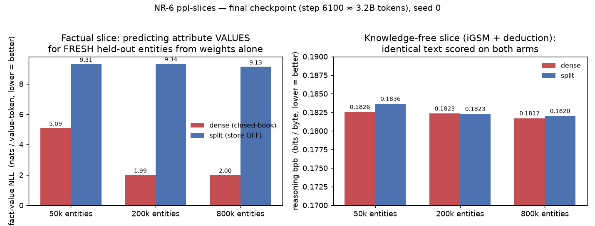

# NR-6 — Perplexity slices (held-out likelihood, dense vs split)

> **Entity population: UNSEEN ≈ FRESH (by design).** The fact-value NLL uses
> held-out entities on purpose (to measure the value *prior*, not memorization);
> our draw is a valid never-seen sample despite the repo generator drift (see
> [`../ENTITY-POPULATIONS.md`](../ENTITY-POPULATIONS.md)). **Why it matters here:**
> the conclusions are **valid as-run** — the split store-OFF ceiling is
> entity-independent, and the dense "prior" is a property of the value distribution.
> (A SEEN condition would additionally show the memorization gap: dense NLL on
> *trained* entities should sit far below its fresh value here.)

## Summary box — read this first
*New here? [START-HERE](../START-HERE.md) explains the dense-vs-split experiment; the one
line you need: the **dense** twin memorizes facts, the **split** twin looks them up — and
here we test the split twin with its lookup table **unplugged**, to see what its weights
know unaided.*

**What this probe asks, in plain terms.** Instead of asking the model to *produce* answers,
we simply measure how **surprised** it is by text we show it — a direct read of what it
"knows." We do this on two kinds of text:
1. **A factual slice** — the *values* of facts (birth city, employer, …) for **fresh people
   the model never trained on**; this measures how well the **weights alone** predict fact
   values.
2. **A knowledge-free slice** — arithmetic/deduction problems that need **no stored facts**,
   scored on identical text for both twins.

**How to read the number.** "Surprise per token" is reported in **nats** (factual slice) or
**bits-per-byte** (reasoning slice); **lower = the model predicts it better / is less
surprised**. If those units are unfamiliar, the **Units primer just below** explains what a
normal vs. striking value looks like — for now, read **lower = better-known**, and focus on
the **gap between the twins**.

**Why it matters — significance & nuance.** This cleanly tests two claims at once:
- **H3 (facts live outside the split twin's weights):** with its table unplugged, the split
  twin should be **far more surprised by fact values** than the dense twin — its weights
  never stored them. (It is: split sits near the "no idea" ceiling at every load.)
- **H2 (no capability tax):** on the knowledge-free reasoning text the twins should be
  **equally surprised** — off-loading facts shouldn't hurt general language modelling.
  (They are, to within noise.)
*Nuance:* the factual slice uses **fresh** people on purpose, so the dense number reflects
its learned **sense of which values are plausible** (a "prior"), **not** memorization of
specific people — don't read it as recall. This is a **behavioural** measurement (what the
model actually predicts), which is stronger evidence about *where facts live* than a
decoding probe — though still not a causal test of *use*.

**Which models / checkpoint / people.** All six twins (dense+split at 50k/200k/800k), at the
finished checkpoint `snapshots/step0006100.pt` (≈3.2 B tokens = end of training). **One seed
⇒ a direction.** The factual slice uses fresh/held-out people (see the entity banner above).

## Units primer — bits, bytes, nats, and is 0.18 "normal"?

Everything below is measured in the model's own currency: **how surprised it is
by the next token.** Three related units:

- **bit** — one yes/no question's worth of information. When the model predicts a
  token it assigns it a probability *p*; the cost ("surprise") of the true token
  is −log₂(*p*) bits. Predict it perfectly (*p*=1) → **0 bits**; a 50/50 guess →
  **1 bit**; one-of-256 equally-likely → **8 bits**. Fewer bits = better
  prediction.
- **nat** — the *same quantity* in natural-log units instead of base-2.
  **1 nat = 1.443 bits** (1 bit = 0.693 nats). We report the factual slice in
  nats only because the code uses natural log; multiply by 1.443 for bits.
- **byte** — a unit of the *text*, not the model: one byte ≈ one character of
  English (UTF-8). **bits-per-byte (bpb)** = total model-surprise over a passage
  ÷ number of text bytes. We use bpb for the reasoning slice because it is
  **tokenizer-independent** — dense and split cut text into different tokens, but
  the byte count of the same string is fixed, so bpb compares them fairly.

A useful sibling number is **perplexity = 2^(bits/token) = e^(nats/token)** —
"the effective number of equally-likely options the model is choosing between at
each token." Perplexity 1 = certain; perplexity 100 = as unsure as guessing among
100 equal choices.

**What is a "normal" number?** For *natural English text*, information content is
roughly **≈1 bit per byte** (Shannon's estimate ≈1.1 bpb; a solid small LM lands
≈0.9–1.2 bpb, the best large models ≈0.6–0.8). So on ordinary prose, ≈1 bpb is
the yardstick.

**Are our numbers normal or interesting?**
- The **reasoning slice sits at ≈0.18 bpb — about 6× *lower* than natural
  English.** This is *not* the model being superhuman; it means the text itself is
  **synthetic and highly templated** (iGSM arithmetic + deduction have rigid
  structure and a tiny vocabulary), so it is intrinsically far more predictable
  than prose. Takeaway: **do not compare 0.18 bpb to LLM-leaderboard numbers on
  real text** — the absolute level reflects how predictable *this* text is. The
  only meaningful comparison is dense-vs-split on the *same* text, where the point
  is that they are essentially equal.
- The **factual-slice numbers are large, and that is the whole point.**
  Converting: split store-OFF ≈ **9.3 nats ≈ 13.4 bits/token ≈ perplexity
  ≈11,000** — as unsure as picking blindly among ≈11,000 options: it genuinely
  does not know the value. Dense n200k ≈ **1.99 nats ≈ 2.9 bits ≈ perplexity ≈7**
  — narrowed to a handful of plausible values. Dense n50k ≈ **5.09 nats ≈ 7.3
  bits ≈ perplexity ≈160**. The split−dense gap of +7.3 nats is a **≈10 bits/token**
  difference — an enormous amount of missing information on a per-value-token
  basis, consistent with "the values simply aren't in the split weights."

**Does this matter for scaling?** Yes — bits/nats-per-token *is* the training loss
(cross-entropy), the exact quantity scaling laws describe (loss falls as a power
law in params/data/compute). Two cautions specific to us: (1) our absolute bpb is
set by how predictable the *synthetic* text is, so it cannot be dropped into a
scaling-law comparison against natural-text models; (2) the scaling-relevant
signal here is the **factual-slice gap and how it moves with load** — dense's
value-NLL improves with more entities (it learns the value distribution) while
split stays pinned, which is the controlled, on-hypothesis quantity.

## Numbers

### Factual slice — fact-value NLL (nats / value-token, lower = better)

| load | dense (closed-book) | split (store OFF) | split − dense |
|------|--------------------:|------------------:|--------------:|
| n50k  | 5.09 | 9.31 | **+4.22** |
| n200k | 1.99 | 9.34 | **+7.34** |
| n800k | 2.00 | 9.13 | **+7.14** |

*Same numbers in bits and perplexity for intuition (× 1.443 → bits; e^nats →
perplexity ≈ "how many equally-likely values it's guessing among"):*

| load | dense bits/tok (perplexity) | split bits/tok (perplexity) |
|------|----------------------------:|----------------------------:|
| n50k  | 7.3 bits (≈160) | 13.4 bits (≈11,000) |
| n200k | 2.9 bits (≈7)   | 13.5 bits (≈11,400) |
| n800k | 2.9 bits (≈7)   | 13.2 bits (≈9,200)  |

Reading: split is always near an "I have no idea" ceiling (≈10k-way guess);
dense at 200k/800k has narrowed to ≈7 plausible values — a learned value prior,
not memorization (fresh entities).

Per-attribute (final ckpt), dense vs split:

| attribute | dense n200k | split n200k | note |
|-----------|------------:|------------:|------|
| birth_date  | 2.57 | 6.90 | date has learnable *format* → split not at full ceiling |
| birth_city  | 2.16 | 11.15 | large categorical vocab → split ≈ uniform ceiling |
| university  | 1.50 | 7.83 | smallest vocab → lowest dense NLL |
| major       | 1.60 | 8.66 | |
| employer    | 1.97 | 11.39 | |
| current_city| 2.14 | 12.22 | |

### Knowledge-free slice — reasoning bpb (bits / byte, lower = better)

| load | dense | split | split − dense |
|------|------:|------:|--------------:|
| n50k  | 0.18255 | 0.18364 | +0.0011 |
| n200k | 0.18233 | 0.18229 | −0.00004 |
| n800k | 0.18170 | 0.18200 | +0.0003 |

Context for the level: **≈0.18 bpb is ≈6× below the ≈1 bpb of natural English**,
because this synthetic reasoning text is highly templated/predictable — so read
these as "both arms model this text almost equally well," *not* as a quality
score comparable to real-text benchmarks. The split−dense differences (≤0.001
bpb) are within single-seed noise.

## Interpretation

**1. Facts are externalized in the split arm — cleanly and at every load (Q2/Q3, H3).**
On the factual slice the split model (store OFF) sits at **≈9.1–9.3 nats/token
regardless of load**. That flat ceiling is the signature of a model that never
learned to predict values in its weights: because value tokens were loss-masked
during split training, the weights carry essentially no value-specific
information, so with the store unplugged the model falls back to a near-uniform
guess over the value vocabulary. Dense, by contrast, spends far fewer nats,
and the **split − dense gap is large and positive at every load (+4.2 to +7.3
nats)** — the on-hypothesis direction. This is a *behavioral* confirmation
(likelihood the model actually assigns), which is stronger evidence than a
linear decoding probe: it is not "the value is decodable from a hidden layer,"
it is "the model itself will not predict the value."

**2. Dense stores value-distribution knowledge in its weights, and more of it with scale.**
Dense fact-value NLL drops from **5.09 (n50k) → 1.99 (n200k) → 2.00 (n800k)**.
Read this carefully: these are **fresh, held-out** entities, so this number is
*not* per-entity memorization — the dense model cannot have memorized an entity
it never saw. What it measures is how well the **weights model the value
distribution and format** (which cities/universities/dates are plausible, in the
right shape). Trained on more distinct entities, dense learns a much tighter
prior over that value space (big jump from 50k→200k), then saturates by 800k.
The split weights never build this prior at all (flat ≈9.3), because that job was
handed to the organizer. So the widening gap at higher load reflects dense
getting *better* at value knowledge while split stays *pinned at zero* — not
split getting worse. (Per-entity closed-book memorization on *training* entities
is measured separately by the recall / extractability probes.)

**3. The split arm keeps format-level regularities it could learn without the store.**
The per-attribute split numbers are not uniformly at ceiling: **birth_date is the
lowest split NLL (5.8–6.9)** while cities/employer sit at ≈11–12. Dates have
low-entropy structure (year ranges, format) that the model can partially predict
even without the specific value, whereas an arbitrary categorical like birth_city
or employer is close to uniform over a large set once the value is externalized.
So "store OFF" does not lobotomize the split arm indiscriminately — it removes
exactly the arbitrary, high-entropy value content and leaves learnable format.

**4. No reasoning regression from splitting (H2 / the "no capability tax" claim).**
On the knowledge-free slice the two arms are **indistinguishable** — the
split − dense bpb difference is ≤0.0011 bits/byte at every load, and at n200k it
is essentially zero (−0.00004). Externalizing facts does **not** cost the model
on reasoning-style text: the capacity freed from memorizing values is at least
not *hurting* language modeling of arithmetic/deduction text. (Whether it is
actively *helping* reasoning is the separate reasoning-accuracy question — see
caveats; the reasoning-accuracy instruments were at chance, so we do not claim a
reasoning *gain* here, only the absence of a *loss*.)

## Caveats (read before citing)

- **Single seed (seed-0 only).** Directional/suggestive, not proven. The
  factual-slice effect is enormous (4–7 nats) and unlikely to be seed noise, but
  the tiny reasoning-bpb differences are well within what a second seed could
  flip in sign — treat "reasoning bpb is equal" as "no detectable regression,"
  not "provably identical."
- **The factual slice uses FRESH entities, so it measures value-distribution /
  format knowledge in the weights, NOT per-entity recall.** Do not report the
  dense 1.99 nats as "dense memorized the fact." Per-entity closed-book
  memorization is the recall/extractability probe's job.
- **This is a likelihood readout, not a causal test.** It tells you what the
  weights predict, which is directly on-hypothesis for "where do facts live," but
  it does not by itself prove the organizer is *causally used* at inference
  (that is the editability / value-injection story).
- **`bio`/`bed` slices were not run.** The script's optional natural-text (`bed`)
  slice needs a `--bed-file` (not provided), and the raw dense-bio slice is
  intentionally replaced by the cleaner value-only NLL to avoid a format confound
  for the split arm. So only `reasoning` bpb + `fact_value_nll` are reported.
- **Sample size:** `--n-docs 200` (script default 300) for speed. 1,200 value
  probes and ≈35.6 k reasoning tokens per run — comfortably enough for the large
  factual effect; the sub-0.001 bpb reasoning differences should be read as
  "within noise," consistent with the single-seed caveat.
- **Reasoning-circuit causal probes remain gated** until the reasoning-accuracy
  evals clear chance (iGSM/deduction accuracy was at chance in the battery). This
  probe is a likelihood measure and is not gated, but it also cannot be used to
  claim a reasoning *improvement*.

## Provenance
Analysis-code addition (NR-6 instrument from the probe toolkit); run locally on
Apple MPS against checkpoints pulled from the FarmShare cluster
(`outputs/_local_probe/<run>/snapshots/step0006100.pt`). Raw JSON per run in this
folder as `{load}_{arm}.json`; figure via `plot_ppl.py`. Report as an additive
analysis instrument per the preregistration (no change to trained models).
